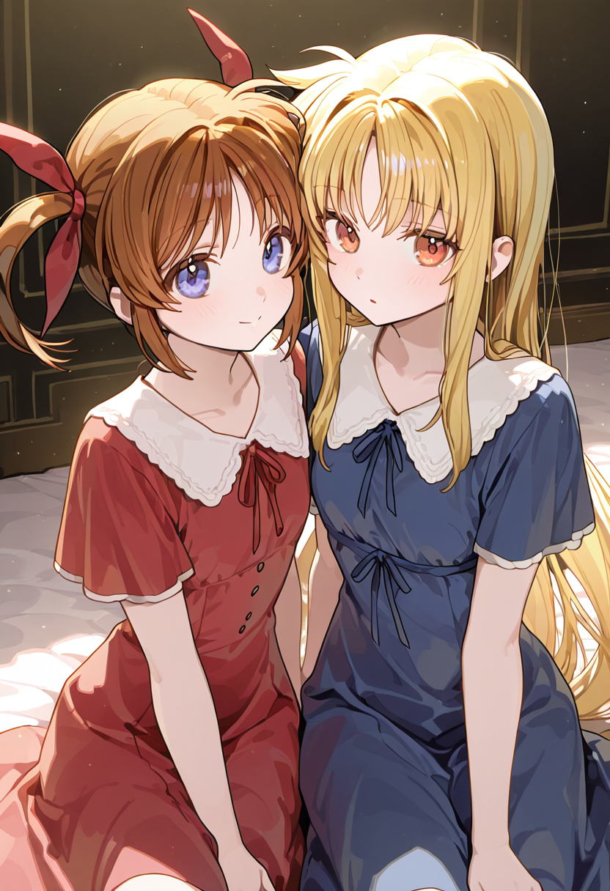
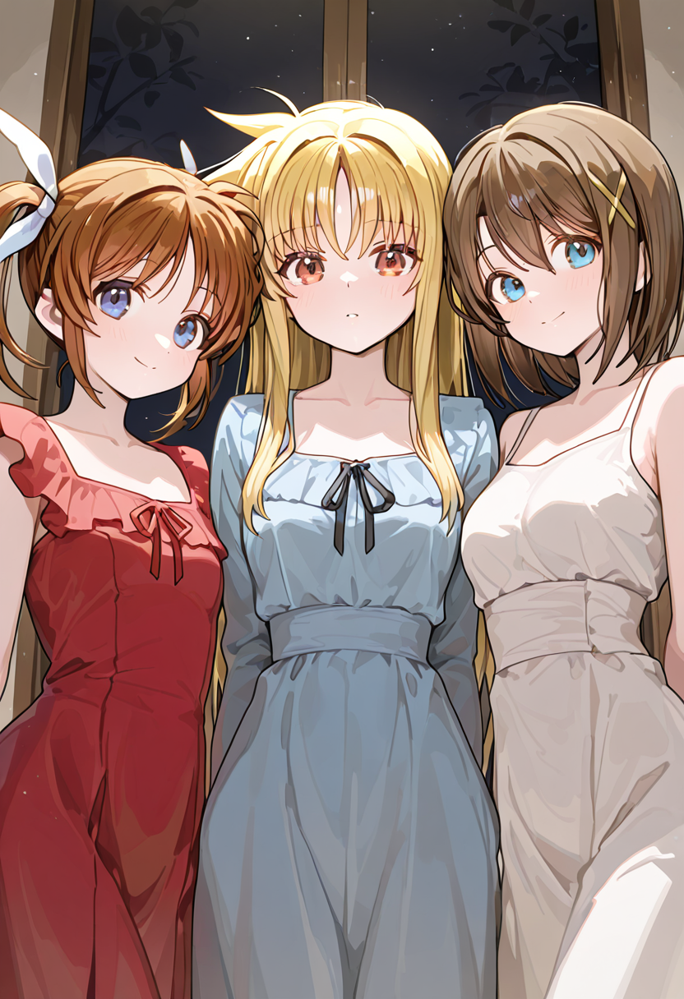

# TiledAttentionCouple

_TiledAttentionCouple_ is a custom node for ComfyUI that enables _Attention Coupling_ across horizontal or vertical tiles. It allows fine(r)-grained control of prompts across different sections of the image. This is especially useful in scenarios where multiple subjects or themes need to coexist in an image without blending them.

## Install

Navigate to your ComfyUI _custom_nodes_ directory:

    cd /path/to/comfyui/custom_nodes

Clone the repository:

    git clone https://github.com/Deathspike/ComfyUI-TiledAttentionCouple

Restart ComfyUI to load the new nodes.

## Configuration

Follow these steps to integrate _Tiled Attention Couple_ into your workflow:

1. Replace positive and negative prompt with _Tiled Attention Couple (Prompt)_.
2. Add _Tiled Attention Couple_. Match `width` and `height` properties to output.
3. Connect _Tiled Attention Couple (Prompt)_ to _Tiled Attention Couple_.
4. Connect _Tiled Attention Couple_ with an input model and clip.
5. Use _Tiled Attention Couple_ output model and conditionings.

## Usage

_TiledAttentionCouple_ slices the image into horizontal or vertical tiles based on your chosen _division_ and _orientation_. The _division_ is a comma-seperated string representing each tile, where each number represents the relative size of that specific tile:

* `1,1` → two equally-sized tiles.
* `1,2` → two tiles, the second is twice as large as the first.
* `1,1,1` → three equally-sized tiles.

The _orientation_ determines how the tiles are divided: _horizontal_ places tiles side by side (left to right), while _vertical_ stacks them on top of each other (top to bottom):

* `1,2` _horizontal_ → bottom tile is twice as large as the top tile.
* `1,2` _vertical_ → right tile is twice as large as the left tile.

Prompts start with a _common prompt_ that applies to the entire image. After this, you can add _tile prompts_ by separating them with the keyword `BREAK`. Each `BREAK` corresponds to a tile in sequential order, from left to right (for _horizontal_) or top to bottom (for _vertical_).

## Previews & Workflows

All previews come with ComfyUI workflows for reference and reproducibility. The showcased results were generated using my [NanoMix v13](https://civitai.com/models/932505/nanomix-multiverse-remix?modelVersionId=1765702) model.

### Nanoha x Fate

    2girls, side-by-side,
    masterpiece, best quality,
    BREAK
    takamachi nanoha, short twintails, 
    red dress,
    BREAK
    fate testarossa, straight hair, 
    blue dress,

The _common prompt_ `2girls, side-by-side, masterpiece, best quality` is applied to the entire image. Using a division of `1,1` and _horizontal orientation_, the left tile receives the _tile prompt_ `takamachi nanoha, short twintails, red dress`, while the right tile receives `fate testarossa, straight hair, blue dress`:

### Nanoha x Fate x Hayate

    3girls, side-by-side,
    masterpiece, best quality,
    BREAK
    takamachi nanoha, short twintails, 
    red dress,
    BREAK
    fate testarossa, straight hair, 
    blue dress,
    BREAK
    yagami hayate, 
    white dress, 

The _common prompt_ `3girls, side-by-side, masterpiece, best quality` is applied to the entire image. Using a division of `1,1,1` and _horizontal orientation_, the left tile receives the _tile prompt_ `takamachi nanoha, short twintails, red dress`, the middle tile receives `fate testarossa, straight hair, blue dress`, while the right tile receives `yagami hayate, white dress`:

### Nanoha x Fate x Hayate (Banner)

    3girls, side-by-side, upper body, 
    blue sky, 
    masterpiece, best quality,
    BREAK
    fate testarossa, straight hair, 
    blue dress,
    nose blush, averting eyes, 
    BREAK
    takamachi nanoha, short twintails, 
    red dress,
    closed eyes, 
    BREAK
    yagami hayate, 
    white dress, 
    naughty face, smug,

The _common prompt_ `3girls, side-by-side, upper body, blue sky, masterpiece, best quality` is applied to the entire image. Using a division of `1,0.75,1` and _horizontal orientation_, the left tile receives the _tile prompt_ `fate testarossa, straight hair, blue dress, nose blush, averting eyes`, the middle tile receives `takamachi nanoha, short twintails, red dress, closed eyes`, while the right tile receives `yagami hayate, white dress, naughty face, smug`:

## Community

If you enjoy _TiledAttentionCouple_, check out more of my work:

* 👉 _Civitai_: https://civitai.com/user/Deathspike
* 🛠️ _GitHub_: https://github.com/Deathspike

Got questions or want to show off something you made with _TiledAttentionCouple_?

* 💬 Join our anime [Discord](https://discord.gg/zSR5FcYWWE). I’m **@Deathspike**, and I’d love to hear from you!

## Credits

"Every tile begins with the foundation laid by others."

* [**@laksjdjf**](https://github.com/laksjdjf)/[attention-couple-ComfyUI](https://github.com/laksjdjf/attention-couple-ComfyUI) for _Attention Couple_ implementation.
* [**@Danand**](https://github.com/Danand)/[ComfyUI-ComfyCouple](https://github.com/Danand/ComfyUI-ComfyCouple) for inspiration on using masks for tiles.
* [**@hako-mikan**](https://github.com/hako-mikan)/[sd-webui-regional-prompter](https://github.com/hako-mikan/sd-webui-regional-prompter) for inspiration on tile configuration.
